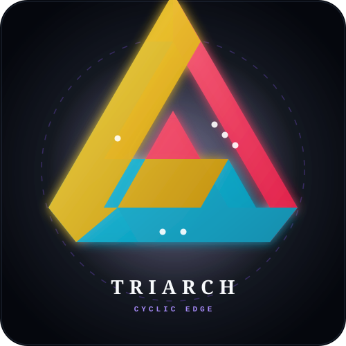

# TRIARCH: Cyclic Edge 🎲🔺🔷🟡

> A strategic 3-player non-transitive tabletop game PWA powered by a mathematically verified dice engine, discrete convolutions, and graph-theoretic intransitive cycle detection.



---

## 🌟 Overview

**TRIARCH: Cyclic Edge** is a zero-build, static Progressive Web App (PWA) built with pure ES Modules and Tailwind CSS. It explores the fascinating realm of **non-transitive game theory**—where standard transitive hierarchies ($A > B \land B > C \implies A > C$) break down into cyclic dominance loops.

### Key Highlights
- 🧠 **Verified Mathematical Core:** Exact discrete probability matrices, generating function convolutions for multi-dice sums, and graph cycle detection.
- ⚡ **Zero-Build Architecture:** Pure native ES modules with zero bundler friction. Compatible with GitHub Pages out of the box.
- 📲 **PWA & Offline First:** Service Worker caching (`sw.js`) with cache-first / stale-while-revalidate strategy, Web App Manifest, and home-screen installability.
- 🔊 **Procedural Web Audio:** Zero external audio files. Real-time acoustic synthesis for dice tumbling, impact clashes, and resonant harmonic chords.
- 🤖 **Game-Theoretic AI Bots:** Cyclic Exploiter, Max-EV Strategist, and Shard Tacticians.
- 🚀 **Automated CI/CD:** GitHub Actions workflow executing mathematical verification tests before deploying to GitHub Pages.

---

## 📐 The Mathematics of Non-Transitive Dice

In standard numbers, the relation $>$ is strictly transitive. With discrete random variables (dice), pairwise superiority forms a tournament graph $(V, E)$ that can contain directed cycles.

### The TRIARCH Balanced Triad
The standard game uses three custom 6-sided dice with **equal expected value** ($E[X] = 5.0$, Sum = 30):

| Archon / Die | Face Configuration | Expected Value $E[X]$ | Variance $\text{Var}(X)$ | Strategic Role |
| :--- | :--- | :---: | :---: | :--- |
| **Ruby Archon (A)** | `[2, 2, 4, 4, 9, 9]` | **5.00** | 9.33 | High explosive ceiling (Twin 9s) |
| **Cyan Sentinel (B)** | `[1, 1, 6, 6, 8, 8]` | **5.00** | 8.00 | Balanced consistency (Mid-high rungs) |
| **Amber Keeper (C)** | `[3, 3, 5, 5, 7, 7]` | **5.00** | 2.67 | Stable central distribution |

#### Exact Pairwise Proofs:
$$\begin{aligned}
P(A > B) &= \frac{20}{36} = \frac{5}{9} \approx 55.56\% \\
P(B > C) &= \frac{20}{36} = \frac{5}{9} \approx 55.56\% \\
P(C > A) &= \frac{20}{36} = \frac{5}{9} \approx 55.56\%
\end{aligned}$$

With **zero possible ties** in pairwise head-to-head combat!

---

## 🌀 Included Mathematical Presets

1. **TRIARCH Triad (Balanced EV 5.0):** Perfectly balanced mean with strict $5/9$ cyclic superiority.
2. **Efron's 4-Dice Ring:** Classic 4-die non-transitive set with $2/3$ ($66.67\%$) edge:
   - $A: [4, 4, 4, 4, 0, 0] \xrightarrow{2/3} B: [3, 3, 3, 3, 3, 3] \xrightarrow{2/3} C: [6, 6, 2, 2, 2, 2] \xrightarrow{2/3} D: [5, 5, 5, 1, 1, 1] \xrightarrow{2/3} A$
3. **Grime 2-Dice Inversion Paradox:** Discovered by Dr. James Grime. Rolling 1 die yields $R > B > O > Y > M > R$. Rolling 2 dice and taking their sum **inverts the entire dominance direction**: $R < B < O < Y < M < R$.
4. **Miwin's Fair Triad (1975):** All dice have identical sum (30) with symmetric $17/36$ win rates and tiebreak distributions.

---

## 📂 Repository File Tree

```
triarch/
├── index.html                    # Responsive PWA UI with Tailwind CSS CDN, Canvas & HUDs
├── manifest.json                 # Web App Manifest for mobile/desktop PWA installation
├── sw.js                         # Service Worker for offline asset caching & lifecycle
├── package.json                  # Project metadata & npm test script
├── triarch.svg                   # Vector brandmark & Penrose cyclic die geometry
├── icons/
│   ├── icon-192.png              # 192x192 PWA app icon
│   ├── icon-512.png              # 512x512 PWA app icon
│   └── icon-maskable.png         # 512x512 Maskable PWA icon
├── src/
│   ├── math/
│   │   ├── dice.js               # Die class, validation, statistical analysis & presets
│   │   ├── probability.js        # Exact pairwise matrix, discrete convolutions, Monte Carlo
│   │   └── index.js              # Math module barrel export
│   ├── game/
│   │   ├── rules.js              # Game rules, phase machine constants & shard definitions
│   │   ├── bots.js               # AI decision engine (Cyclic Exploiter, Max EV, Tactician)
│   │   ├── state.js              # GameStateManager, round resolution & history ledger
│   │   └── index.js              # Game engine barrel export
│   ├── audio/
│   │   └── sfx.js                # Procedural Web Audio synthesizer (rolls, clashes, chimes)
│   └── ui/
│       ├── visualizer.js         # Canvas cyclic graph renderer & 3D dice animations
│       ├── components.js         # DOM renderers (HUDs, Odds Matrix, Paradox visualizer)
│       └── app.js                # Master application controller & PWA lifecycle hooks
├── test/
│   ├── dice.test.js              # Mathematical proofs for Die class, EV, variance & presets
│   ├── probability.test.js       # Convolutions, 3-way clash, Monte Carlo & graph cycles
│   └── game.test.js              # State transitions, bot behavior & clash resolutions
└── .github/
    └── workflows/
        └── deploy.yml            # CI/CD pipeline verifying math tests & deploying to Pages
```

---

## 🛠️ Local Development & Testing

### Running Tests
Execute the native Node.js automated test runner:
```bash
npm test
```

### Running Locally
Because this project uses pure ES Modules, run any lightweight static web server:
```bash
# Using Python 3
python3 -m http.server 8080

# Or using npx serve
npx -y serve .
```
Then open `http://localhost:8080` in any modern web browser.

---

## 📜 License
MIT License. Created for mathematics enthusiasts, game theorists, and tabletop strategists.
